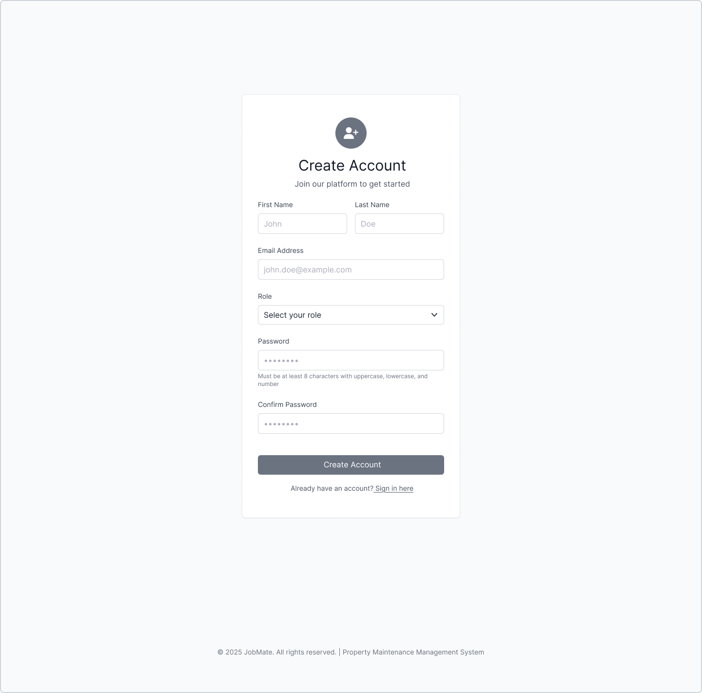

# JobMate
A Django-based job management system for property maintenance. Built with Django, PostgreSQL, HTML, and Bootstrap. Includes user registration, engineer job tracking, shopping cart and full CRUD functionality for managing bookings and job records in a clean, responsive interface.

## What This Project Is

This application lets property managers and engineers:
- **Book maintenance jobs** such as boiler servicing, repairs, and inspections  
- **View and manage job history** with status updates and filtering  
- **Track job statuses** (Pending, In Progress, Completed) via a dashboard  
- **Assign engineers** to individual jobs 
- **Invoice jobs** add jobs to shopping cart
- **Update cart** update the actual hours worked per job 
- **Pay for completed jobs** using Stripe payment gateway

---

## Property Manager User Story

As a **Property Manager**, I want to:

- **Log in securely** to access my dashboard and manage job-related data.
- **Create, view, edit, and delete jobs** by filling out forms with details like:
  - Job title
  - Description
  - Assigned engineer
- **Assign engineers to jobs** so the right person is notified and responsible.
- **Manage engineers**:
  - View a list of engineers
  - Edit engineer details
  - Delete engineers when no longer needed
- **Manage payments**:
  - Use stripe gateway to pay engineers for completed jobs
  - Track submitted jobs via a list or dashboard to monitor status and progress
- **Update my user profile and password** to maintain account security and accuracy.

As a **Engineer**, I want to:
- **Log in securely** to access my dashboard and manage job-related data.
- View my **own jobs**  
- Update job status (e.g., mark completed)  
- **Add jobs for payment** Once the job has been completed add it to the cart.
- **Adjust jobs costs** Update the actual hours or other incured costs worked on the job.
- **Maintain my own** profile and security settings.

---

## Tech Stack

- Django (Python Web Framework)  
- PostgreSQL (Relational Database)  
- HTML5 + Bootstrap 5 (Frontend UI)  
- Django Templating Engine (Jinja-like)  
- Django Admin (for quick management)  

---

## Figma Files

  <strong>Colour Pallette</strong> 
  

<h1 align="left">
   <strong>Wireframe</strong> 
</h1>

  <strong>Welcome</strong> 
  

  <strong>Create Account</strong> 
  

  <strong>Login</strong> 
  

  <strong>Logged Out</strong> 
  

  <strong>Reset Password</strong> 
  

  <strong>Profile Settings</strong> 
  

  <strong>Admin Dashboard</strong> 
  

  <strong>Create a Job</strong> 
  

  <strong>Edit a Job</strong> 
  

  <strong>Delete a Job</strong> 
  

  <strong>Job Details</strong> 
  

  <strong>Engineer Dashboard</strong> 
  

  <strong>Engineers List</strong> 
  

  <strong>Engineer Payments Summary</strong> 
  

  <strong>Admin Payments Summary</strong> 
  

  <strong>Cart</strong> 
  

  <strong>Pricing Adjustment</strong> 
  

<h1 align="left">
   <strong>Hi-Fi</strong> 
</h1>

  <strong>Welcome</strong> 
  

  <strong>Create Account</strong> 
  

  <strong>Login</strong> 
  

  <strong>Logged Out</strong> 
  

  <strong>Reset Password</strong> 
  

  <strong>Profile Settings</strong> 
  

  <strong>Admin Dashboard</strong> 
  

  <strong>Create a Job</strong> 
  

  <strong>Edit a Job</strong> 
  

  <strong>Delete a Job</strong> 
  

  <strong>Job Details</strong> 
  

  <strong>Engineer Dashboard</strong> 
  

  <strong>Engineers List</strong> 
  

  <strong>Engineer Payments Summary</strong> 
  

  <strong>Admin Payments Summary</strong> 
  

  <strong>Cart</strong> 
  

  <strong>Pricing Adjustment</strong> 
  

<h1 align="left">
   <strong>Mobile Hi-fi</strong> 
</h1>

  <strong>Welcome</strong> 
  

  <strong>Create Account</strong> 
  

  <strong>Login</strong> 
  

  <strong>Logged Out</strong> 
  

  <strong>Reset Password</strong> 
  

  <strong>Profile Settings</strong> 
  

  <strong>Admin Dashboard</strong> 
  

  <strong>Create a Job</strong> 
  

  <strong>Delete a Job</strong> 
  

  <strong>Job Details</strong> 
  

