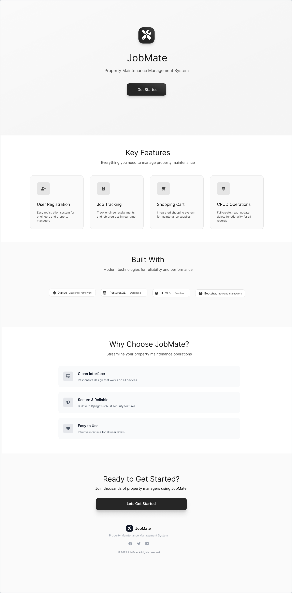
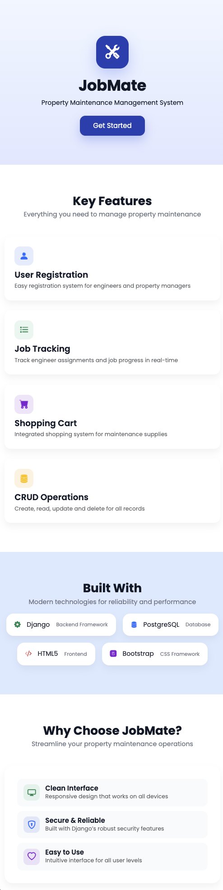
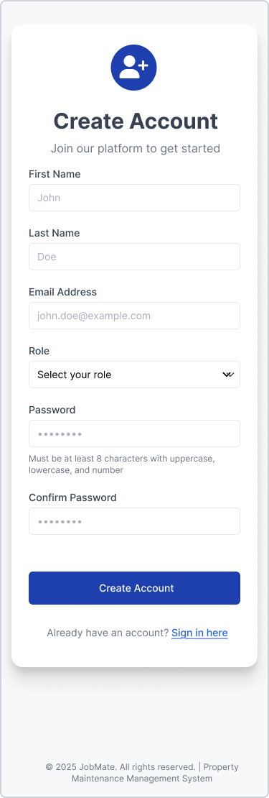
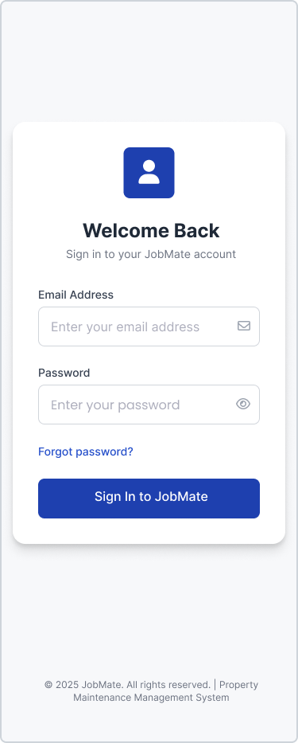

# JobMate – Job & Payment Management System

## What This Project Is

**JobMate** is a Django-based web application designed to manage maintenance jobs, operatives, and job payments within a structured workflow.

The system demonstrates:
- job lifecycle management
- role-based access control
- relational database design
- calculated values
- real-world backend logic

---

## User Roles

### Property Manager (Admin)
- Manages jobs and operatives
- Oversees job progress and payment status
- Reviews completed jobs before payment

### Operative
- Views and completes assigned jobs
- Triggers the payment workflow for completed jobs
- Tracks payment status

---

## Core Features 

### Job Management
- Create, view, edit, and delete jobs
- Assign operatives to indivisual jobs
- Search and filter jobs
- Track job status:
  - Pending
  - In Progress
  - Completed
  - Cancelled

---

### Job Completion Workflow
When a job is marked as **completed**:

1. The job status is updated
2. A single transaction is created and linked to the job
3. The job is added to the payment basket

This design ensures:
- one transaction per job
- no duplicate payment records
- a clear separation between job data and payment data

---

### Transactions & Payments
- Each completed job has **one linked transaction**
- A transaction represents the payment state of a job
- Transaction statuses include:
  - Open
  - Paid
  - Failed
  - Cancelled

Transactions store:
- base job cost
- adjustment totals
- calculated totals
- payment status

---

### Adjustment Line Items
- Transactions may contain **multiple adjustment line items**
- Adjustments allow additional costs to be added (e.g. extra labour or materials)
- Each adjustment includes:
  - description
  - quantity
  - unit price
  - automatically calculated line total

---

### Basket
- Displays all open transactions
- Groups transactions by user so payments can be reviewed separately
- Automatically calculates:
  - subtotal
  - service fee
  - total amount
- Access rules:
  - Admin can view all transactions
  - Operatives can only view their own transactions

---

## User Stories

### As a Property Manager, I want to:
- Log in securely
- Manage my profile details and password
- Create, assign, and manage jobs
- View all operatives and their job progress
- Review completed jobs before payment
- Adjust job costs where required
- Track payment status

### As an Operative, I want to:
- Log in securely
- View only jobs assigned to me
- Update job status when work is completed
- Add completed jobs to the payment basket
- Track payment status
- Update my own profile details

---

## User Flow Overview

### Property Manager Flow
1. Log in
2. Access dashboard
3. Manage jobs and operatives
4. Review completed jobs in the basket
5. Confirm job costs
6. Track payment status

### Operative Flow
1. Log in
2. View assigned jobs
3. Complete jobs
4. Add jobs to the basket
5. View payment status

---

## System Design 

### Core Data Models
This project is structured around **three core model groups**:
- Users
- Jobs
- Cart (Transactions)

### Model Relationships

<p align="center">
  <strong>Relationships</strong><br>
  
</p>

---

### Design Rules
- One job → one transaction
- One transaction → many adjustment line items
- Jobs are never duplicated in the basket
- All relationships are enforced using Django Foreign Keys

---

## Permissions & Security
- All views are protected using `@login_required`
- Role-based permission checks ensure:
  - Admins can manage all jobs and transactions
  - Operatives can only access assigned jobs and related payments
- Direct URL access is validated and restricted at view level

---

## Testing Strategy
- Automated **model tests** ensure correct data creation and relationships
- **View tests** validate permissions, redirects, and access rules
- Manual testing verifies UI behaviour and full workflows

---

## Tech Stack
- Django
- PostgreSQL
- HTML5
- Bootstrap
- Django Templating Engine
- Django Admin

---

## Future Enhancements
- Online payment gateway integration
- Invoice generation
- Reporting and analytics
- Refund handling

---

## Figma Files

<p align="center">
  <strong>Colour Pallette</strong><br>
  
</p>

<h1 align="left">
   <strong>Wireframe</strong><br>
</h1>

<p align="center">
  <strong>Welcome</strong><br>
  
</p>

<p align="center">
  <strong>Create Account</strong><br>
  
</p>

<p align="center">
  <strong>Login</strong><br>
  
</p>

<p align="center">
  <strong>Logged Out</strong><br>
  
</p>

<p align="center">
  <strong>Reset Password</strong><br>
  
</p>

<p align="center">
  <strong>Profile Settings</strong><br>
  
</p>

<p align="center">
  <strong>Admin Dashboard</strong><br>
  
</p>

<p align="center">
  <strong>Create a Job</strong><br>
  
</p>

<p align="center">
  <strong>Edit a Job</strong><br>
  
</p>

<p align="center">
  <strong>Delete a Job</strong><br>
  
</p>

<p align="center">
  <strong>Job Details</strong><br>
  
</p>

<p align="center">
  <strong>Operative Dashboard</strong><br>
  
</p>

<p align="center">
  <strong>Operatives List</strong><br>
  
</p>

<p align="center">
  <strong>Operative Payments Summary</strong><br>
  
</p>

<p align="center">
  <strong>Admin Payments Summary</strong><br>
  
</p>

<p align="center">
  <strong>Cart</strong><br>
  
</p>

<p align="center">
  <strong>Pricing Adjustment</strong><br>
  
</p>

<h1 align="left">
   <strong>Hi-Fi</strong><br>
</h1>

<p align="center">
  <strong>Welcome</strong><br>
  
</p>

<p align="center">
  <strong>Create Account</strong><br>
  
</p>

<p align="center">
  <strong>Login</strong><br>
  
</p>

<p align="center">
  <strong>Logged Out</strong><br>
  
</p>

<p align="center">
  <strong>Reset Password</strong><br>
  
</p>

<p align="center">
  <strong>Profile Settings</strong><br>
  
</p>

<p align="center">
  <strong>Admin Dashboard</strong><br>
  
</p>

<p align="center">
  <strong>Create a Job</strong><br>
  
</p>

<p align="center">
  <strong>Edit a Job</strong><br>
  
</p>

<p align="center">
  <strong>Delete a Job</strong><br>
  
</p>

<p align="center">
  <strong>Job Details</strong><br>
  
</p>

<p align="center">
  <strong>Operative Dashboard</strong><br>
  
</p>

<p align="center">
  <strong>Operatives List</strong><br>
  
</p>

<p align="center">
  <strong>Operative Payments Summary</strong><br>
  
</p>

<p align="center">
  <strong>Admin Payments Summary</strong><br>
  
</p>

<p align="center">
  <strong>Cart</strong><br>
  
</p>

<p align="center">
  <strong>Pricing Adjustment</strong><br>
  
</p>

<h1 align="left">
   <strong>Mobile Hi-fi</strong><br>
</h1>

<p align="center">
  <strong>Welcome</strong><br>
  
</p>

<p align="center">
  <strong>Create Account</strong><br>
  
</p>

<p align="center">
  <strong>Login</strong><br>
  
</p>

<p align="center">
  <strong>Logged Out</strong><br>
  
</p>

<p align="center">
  <strong>Reset Password</strong><br>
  
</p>

<p align="center">
  <strong>Profile Settings</strong><br>
  
</p>

<p align="center">
  <strong>Admin Dashboard</strong><br>
  
</p>

<p align="center">
  <strong>Create a Job</strong><br>
  
</p>

<p align="center">
  <strong>Delete a Job</strong><br>
  
</p>

<p align="center">
  <strong>Job Details</strong><br>
  
</p>

---

## Automated Tests Outcome

| Test File                   | Description                                                                                           | Status |
| --------------------------- | ----------------------------------------------------------------------------------------------------- | ------ |
| `test_signup.py`            | Tests Operative signup page load, successful signup, duplicate email and password mismatch validation | Passed |
| `test_login.py`             | Tests login page load, successful login email and password mismatch validation                        | Passed |
| `test_password_reset.py`    | Tests reset page load, successful reset and signin with new password                                  | Passed |
| `test_page_access.py`       | Registered users can access certain pages, and that public pages are accessible to all users          | Passed |
| `test_home.py`              | Tests home page loads                                                                                 | Passed |
| `test_cart_pages_access.py` | Registered users can only access cart pages                                                           | Passed |
| `test_profile.py`           | Test user, profile, bank info loads when logged in and updates and saves data successfully,           | Passed |
|                             | Password change updates and user can log in with new password                                         | Passed |
| `test_create_job.py`        | Test a job can be created                                                                             | Passed |
| `test_display_all_jobs.py`  | Tests creates jobs and checks if it has been created                                                  | Passed |
| `test_edit_job.py`          | Creates a new job and tests if it can be updated                                                      | Passed |

---

## Automated Tests Outcome Results

<p align="center">
  <strong>test_signup</strong><br>
  
</p>

<p align="center">
  <strong>test_login</strong><br>
  
</p>

<p align="center">
  <strong>test_password_reset</strong><br>
  
</p>

<p align="center">
  <strong>test_page_access</strong><br>
  
</p>

<p align="center">
  <strong>test_home</strong><br>
  
</p>

<p align="center">
  <strong>test_cart_pages_access</strong><br>
  
</p>

<p align="center">
  <strong>test_profile</strong><br>
  
</p>

<p align="center">
  <strong>test_create_job</strong><br>
  
</p>

<p align="center">
  <strong>test_display_all_jobs</strong><br>
  
</p>

<p align="center">
  <strong>test_edit_job</strong><br>
  
</p>

---

## Manual Tests Outcome Results

| Test View                     | Description                                                                                                                     | Status |
| ----------------------------- | ------------------------------------------------------------------------------------------------------------------------------- | ------ |
| `signup`                      | Signup page load, successful signup, duplicate email handling, and password mismatch validation                                 | Passed |
| `login`                       | Login page load, successful login, and invalid email/password validation                                                        | Passed |
| `password_reset`              | Password reset page loads, successful reset, and sign-in with new password                                                      | Passed |
| `page_access`                 | Registered users can access protected pages and public pages are accessible to all users                                        | Passed |
| `home`                        | Home page loads successfully                                                                                                    | Passed |
| `cart_pages_access`           | Verifies that only registered users can access cart-related pages                                                               | Passed |
| `profile`                     | User profile and bank information load when logged in and that updates are saved successfully                                   | Passed |
| `create_job`                  | Page loads correctly, all fields submitted, job data saved (verified in admin) - redirects to all jobs                          | Passed |
| `all_jobs`                    | Jobs are displayed with all submitted data, Operatives can view their own jobs only                                             | Passed |
| `Operative_job_access`        | Verifies that Operatives can only view jobs assigned to them, while administrators can view all jobs                            | Passed |
| `edit_job`                    | Job loads correctly by ID, all job fields are rendered, omly admin can view, job submits and redirects                          | Passed |
| `delete_job`                  | Admin can only view & delete job, checked in UI and admin panel and record removed from DB                                      | Passed |
| `any job id in url`           | If a ID is entered manually in url, then no jobs found loads                                                                    | Passed |
| `404`                         | Unknown urls displays a 404.html page                                                                                           | Passed |
| `all_Operatives`              | Displays all Operatives that have signed up                                                                                     | Passed |
| `search jobs`                 | Jobs can be searched by keyword using job title, address, city and postcode. Status list does filter                            | Passed |
| `search Operatives`           | Operatives can be searched by keyword, using first last name, role and status                                                   | Passed |
| `view_Operatives`             | Admin can view, edit Operatives phone, role, status and bank details. For admin password fields hidden when viewing other users | Passed |
| `complete_job`                | Admin, users complete jobs and gets passed to basket                                                                            | Passed |
| `add_adjustment`              | Admin, users complete adjustments if required, adjustment totals all line items, and updates the basket with all totals         | Passed |
| `basket`                      | Displays jobs, adjustments, subtotal, service fee, vat, totals per user, so they cab be paid seperatly                          | Passed |
| `delete line item`            | Delete indivisual line items, total recalculates, admin can delete globally, users can only delete their transactions           | Passed |
| `delete job from cart`        | Delete user grouped jobs from basket, job status changes to in progress                                                         | Passed |
| `Stripe`                      | Order completes, cancels, declines successfully, admin canonly pay operatives, all totals calculate as expected                 | Passed |
| `payments_summary.html`       | Displays all paid orders with accumulated totals for all transactions relating to a order                                       | Passed |
| `payment search, filter`      | Order search displays required results by keyword, status filtering displays relevent results                                   | Passed |

---

## Credits and Acknowledge

- Design ideas to Dribble amd Mobbin
- Colour pallette to coolors.co
- CSS style for input tags to StackOverflow
- Testing to NetNinja, Legion Script from YouTube
- Password reset to https://pypi.org

---

---

## Local Deployment Mac
```bash
cd path/to/your/JobMate
source .venv/bin/activate
python manage.py runserver
Open http://127.0.0.1:8000/
```

## Deployment to AWS (Production)

  - Live address http://13.48.56.234

This section explains how the JobMate project is deployed to an AWS server and how updates are applied. I have created two git branches. Th main branch will hold the production code and the develop branch is for development.

---

### Overview

- The project is hosted on an AWS EC2 Ubuntu server 
- Django runs using Gunicorn
- Nginx is used as the web server
- Code is stored on GitHub
- The `main` branch represents production
- The `develop` branch is used for development
- The database file (`db.sqlite3`) is not tracked by Git

---

### Important Rule

The SQLite database file (`db.sqlite3`) is ignored because:
- The database changes whenever the app runs
- Local and production data will be different

---

### Server Directory Structure

The project is located at: /var/www/jobmate/JobMate
The SQLite database is located at: /var/www/jobmate/JobMate/jobmate/db.sqlite3

---

### Setup server AWS EC2
```bash
ssh -i ~/.ssh/job_mate.pem ubuntu@13.48.56.234/
```

## Navigate to the project directory and deploy
```bash
cd /var/www/jobmate/JobMate
git pull origin main
source .venv/bin/activate
pip install -r requirements.txt
python manage.py migrate
python manage.py collectstatic --noinput
sudo systemctl restart gunicorn
sudo systemctl reload nginx
```

---

### Updating the Server After Code Changes

## Local Machine - Work in develop branch
```bash
git checkout develop
# make changes
git commit -m "Description of change"
```

## Local Machine - Merge cahnges into main
```bash
git checkout main
git pull origin main
git merge develop
git push origin main
```

### Production Server AWS EC2

## Connect to the server and pull the latest production code
```bash
ssh -i ~/.ssh/job_mate.pem ubuntu@13.48.56.234
cd /var/www/jobmate/JobMate
git pull origin main
```
## Apply updates and restart the application
```bash
cd jobmate
pip install -r requirements.txt
python manage.py migrate
python manage.py collectstatic --noinput
sudo systemctl restart gunicorn

```


### Stripe Results (localhost used as Stripe requies SSL on live servers)

<p align="center">
  <strong>Stripe Success Payment Cart</strong><br>
  
</p>

<p align="center">
  <strong>Stripe Payment Success Page</strong><br>
  
</p>

<p align="center">
  <strong>Stripe Payment Declined Cart</strong><br>
  
</p>

<p align="center">
  <strong>Stripe Payment Declined Page</strong><br>
  
</p>


<p align="center">
  <strong>Stripe Cancelled Payment Page</strong><br>
  
</p>


## Git Development Timeline

The timeline below outlines regular commits for progress, features, refactoring.

---

### Project Setup & Planning
- **20/09/2025** – Initial project planning and requirements defined  
- **27/09/2025** – User stories added  
- **11/10/2025** – Django project initialised  
- **11/10/2025** – Figma designs created  

---

### Job Management Core
- **17/10/2025** – Dashboard layout and search implemented  
- **23/10/2025** – Jobs dashboard completed  
- **24/10/2025** – Job creation and editing views implemented  
- **31/10/2025** – Payments view created  

---

### Authentication & Testing
- **20/11/2025** – Dashboard and payments views developed  
- **21/11/2025** – Views protected with authentication and permissions  
- **22/11/2025** – Login, signup, and account tests completed  
- **26/11/2025** – Password reset and authentication tests added  

---

### Profiles, Roles & Permissions
- **20/12/2025** – Job filtering by status and priority  
- **21/12/2025** – Job CRUD functionality completed and tested  
- **23/12/2025** – Profile settings and role management implemented  
- **23/12/2025** – Custom 404 page created  

---

### Transactions, Cart & Orders
- **25/12/2025** – Job assignment and engineer filtering features added  
- **26/12/2025** – Engineer terminology refactored to operatives  
- **30/12/2025** – Cart adjustments and line item logic implemented  
- **30/12/2025** – Permissions added to cart and payment views  
- **31/12/2025** – Basket styling and UI refinements  

---

### Payments & Basket Logic
- **02/01/2026** – Secure environment setup (.env, .gitignore, secrets removed)  
- **03/01/2026** – Stripe payment integration completed  
- **04/01/2026** – Payment confirmation pages implemented  
- **04/01/2026** – Jobs restricted to single basket entry  
- **04/01/2026** – Payments summary, search, and status pages added  

---

### Finalisation & Deployment Preparation
- **09/01/2026** – Stripe testing screenshots added  
- **10/01/2026** – Model relationship diagram added  
- **10/01/2026** – Updated settings and environment configuration  
- **10/01/2026** – Removed commented-out code and cleaned production files  
- **10/01/2026** – Changed Debug to False 

---